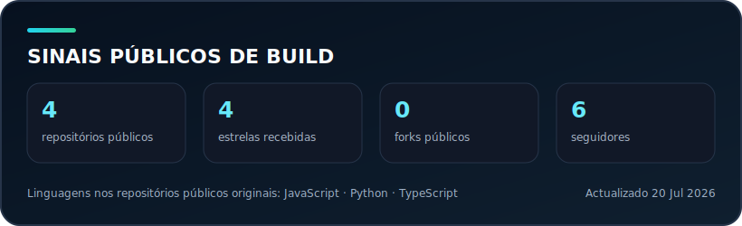

 

Trabalho com dados em produção: pipelines que correm todos os dias, APIs que alimentam dashboards e monitorização que avisa quando algo falha. Gosto de arquitectura simples, evidência em vez de slides e documentação que ainda serve depois da entrega.

## Sobre mim

- Actualmente a construir e manter pipelines, APIs e sinais de observabilidade em contexto municipal
- Pergunta-me sobre ingestão de dados, Power BI, Docker ou como transformar falhas de pipeline em alertas úteis
- Habito: cada entrega leva changelog — mesmo quando ninguém pede
- Baseado em Portugal · trabalho em português europeu e inglês

## Stack

  
  
  
  
  
  
  
  
  
  
  

## Estatísticas GitHub

  
  

## Gráfico de contribuições

  

## Sinais públicos de build

  

## Citação dev

  

## Trabalho seleccionado

| Projecto | Tipo | O que faz | Acesso |
| --- | --- | --- | --- |
| [WELLS_OS](https://wells-os.vercel.app) | Profissional | Consola read-only dos serviços e servidores onde os meus projectos correm. | Produto activo; código privado |
| [Case study Maia](https://emanuwells.vercel.app/maia) | Case study | Como liguei pipelines de ingestão, catálogo, APIs e observabilidade num ecossistema municipal. | Página pública |
| [Overseer](https://github.com/emanuwells/Overseer) | Profissional | Segue execuções de pipeline: o que correu, o que falhou e o sinal operacional que daí sai. | Código público |
| [Warden](https://github.com/emanuwells/Warden) | Profissional | Telemetria de servidores, retenção e alertas sem mexer no runtime de produção. | Código público |
| [Vacation Mode](https://github.com/emanuwells/Vacation_Mode) | Hobby / script | Automação pessoal para manter rotinas estáveis quando estou fora — não é stack de produção. | Código público |

`WELLS_API` e `Traffic Flow` aparecem no case study e em demos públicas enquanto os repositórios passam por revisão de prontidão para publicação.

## Foco actual

- Pipelines que ingestam, transformam e expõem dados com falhas visíveis
- APIs estáveis para BI e integrações
- Observabilidade que transforma um job vermelho num alerta acionável
- Interfaces simples para sistemas operacionais complexos

O case study Maia é um relato técnico pessoal e não constitui uma publicação oficial da Câmara Municipal da Maia.

---

Este repositório é o meu perfil GitHub e a fonte do portefólio. A app Next.js está em [`site/`](site/); os comandos estão em [`COMMANDS.md`](COMMANDS.md).

