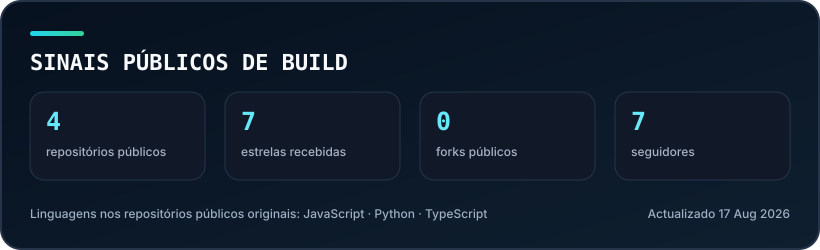

<div align="center">

[](https://emanuwells.vercel.app)

<br />

Trabalho com dados em produção: pipelines que correm todos os dias, APIs que alimentam dashboards e monitorização que avisa quando algo falha — antes de alguém perguntar. Gosto de arquitectura simples, evidência em vez de slides e documentação que ainda serve depois da entrega.

[**Portefólio**](https://emanuwells.vercel.app) · [**Case study Maia**](https://emanuwells.vercel.app/maia) · [**WELLS_OS**](https://wells-os.vercel.app) · [**LinkedIn**](https://www.linkedin.com/in/emanuel-ferreira91)

## Sobre mim

- Construo e mantenho o ecossistema de dados de um município: ingestão, catálogo, APIs e observabilidade
- Pergunta-me sobre ingestão de dados, Power BI, Docker ou como transformar um job vermelho num alerta acionável
- Hábito: cada entrega leva changelog e evidência — mesmo quando ninguém pede
- Baseado em Portugal · trabalho em português europeu e inglês

## Stack

<p align="center">
  
  
  
  
  
  
  
  
  
  
  
  
</p>

## O ecossistema WELLS

Os meus projectos não são repositórios isolados — trabalham em conjunto, em produção:

```text
pipelines (Python) ──▶ WELLS_API ──▶ Power BI · dashboards · integrações NGSI-LD
      │                    ▲
      ├── Overseer ────────┤   observabilidade de pipelines (runs, logs, alertas)
      └── Warden ──────────┘   telemetria de servidores (CPU, RAM, disco, MariaDB)
                           │
                       WELLS_OS   consola read-only — a sala de controlo
```

- **WELLS_API** é a espinha dorsal: uma API municipal em PHP que expõe datasets, observações de tráfego (GeoJSON/NGSI-LD) e snapshots do Warden a dashboards, Power BI e integrações externas.
- **WELLS_OS** é a sala de controlo: uma consola read-only, protegida por login, que agrega métricas Warden, execuções Overseer e o registo de aplicações — observa tudo sem tocar no runtime.

## Trabalho seleccionado

| Projecto | Tipo | O que faz | Acesso |
| --- | --- | --- | --- |
| [WELLS_OS](https://wells-os.vercel.app) | Profissional | Consola operacional read-only: métricas Warden, execuções Overseer e registo de aplicações num só painel. | Produto activo; código privado |
| WELLS_API | Profissional | API municipal que serve datasets, tráfego em GeoJSON/NGSI-LD e telemetria a Power BI e integrações externas. | Em produção; código privado |
| [Case study Maia](https://emanuwells.vercel.app/maia) | Case study | Como liguei seis pipelines, catálogo, APIs e observabilidade num ecossistema municipal — do zero à produção em ~8 meses. | Página pública |
| [Overseer](https://github.com/emanuwells/Overseer) | Profissional | Observabilidade Docker-first para pipelines e DAGs externos: catálogo, runs, logs e heartbeats por API, dashboard read-only e alertas Slack. | Código público |
| [Warden](https://github.com/emanuwells/Warden) | Profissional | Collector Python que vigia CPU, RAM, disco, rede e MariaDB; exporta snapshots consumidos pelo WELLS_API e alerta no Slack. | Código público |
| Traffic Flow | Profissional | Transforma contagens das câmaras de tráfego da Maia em observações normalizadas — GeoJSON e NGSI-LD com URN estável. | API pública; código privado |
| [Vacation Mode](https://github.com/emanuwells/Vacation_Mode) | Hobby | Google Apps Script que converte uma grelha anual de férias pintada à mão em eventos do Google Calendar. | Código público |

## Estatísticas GitHub

<p align="center">
  
  
</p>

## Gráfico de contribuições

<p align="center">
  
</p>

## Sinais públicos de build

<p align="center">
  
</p>

## Foco actual

- Pipelines que ingerem, transformam e expõem dados com falhas visíveis
- APIs estáveis para BI, mapas e integrações smart city (NGSI-LD, Smart Data Models)
- Observabilidade que transforma um job vermelho num alerta acionável
- Interfaces simples para sistemas operacionais complexos

<sub>O case study Maia é um relato técnico pessoal e não constitui uma publicação oficial da Câmara Municipal da Maia.</sub>

---

Este repositório é o meu perfil GitHub e a fonte do portefólio. A app Next.js está em [`site/`](site/); os comandos estão em [`COMMANDS.md`](COMMANDS.md); o contrato de agentes em [`.agents/AGENTS.md`](.agents/AGENTS.md).
</div>
